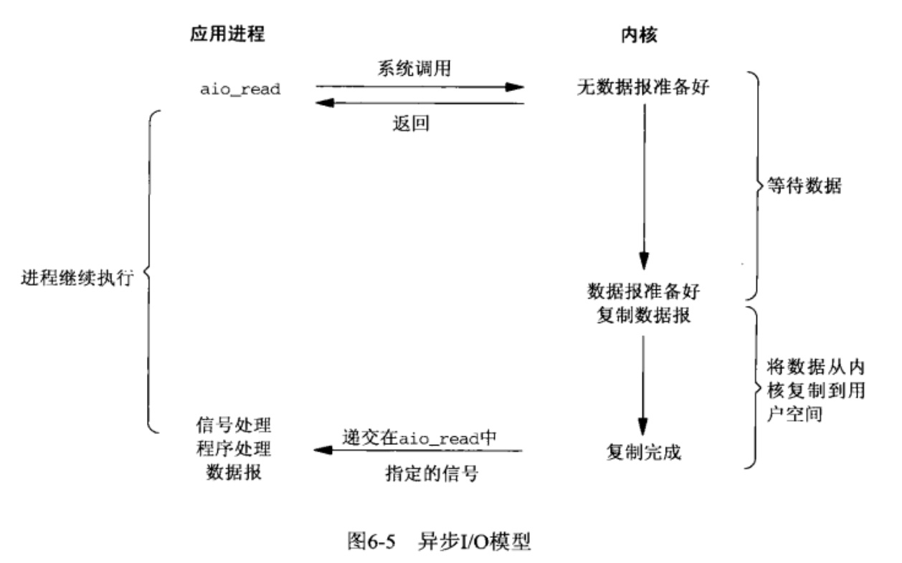

# Linux I/O 模型

- 阻塞式 I/O
- 非阻塞式 I/O
- I/O 复用
- 信号驱动式 I/O
- 异步 I/O

## 阻塞式 I/O

阻塞IO意味着当我们发起一次IO操作后一直等待成功或失败之后才返回，在这期间程序不能做其它的事情。阻塞IO操作只能对单个文件描述符进行操作。

## 非阻塞式I/O

非阻塞IO通常发生在一个for循环当中，因为每次进行IO操作时要么IO操作成功，要么当IO操作会阻塞时返回错误EWOULDBLOCK/EAGAIN，然后再根据需要进行下一次的for循环操作，这种类似轮询的方式会浪费很多不必要的CPU资源，是一种糟糕的设计。和阻塞IO一样，非阻塞IO也是通过调用read&write来进行操作的，也只能对单个描述符进行操作。

## I/O 复用

首先会对一组文件描述符进行相关事件的注册，然后阻塞等待某些事件的发生或等待超时。O多路复用都可以关注多个文件描述符，但对于这三种机制而言

## 信号驱动式 I/O

利用信号机制，让内核告知应用程序文件描述符的相关事件。

## 异步 I/O

相比信号驱动IO需要在程序中完成数据从用户态到内核态(或反方向)的拷贝，异步IO可以把拷贝这一步也帮我们完成之后才通知应用程序。

## Reference

- 《Unix网络编程》