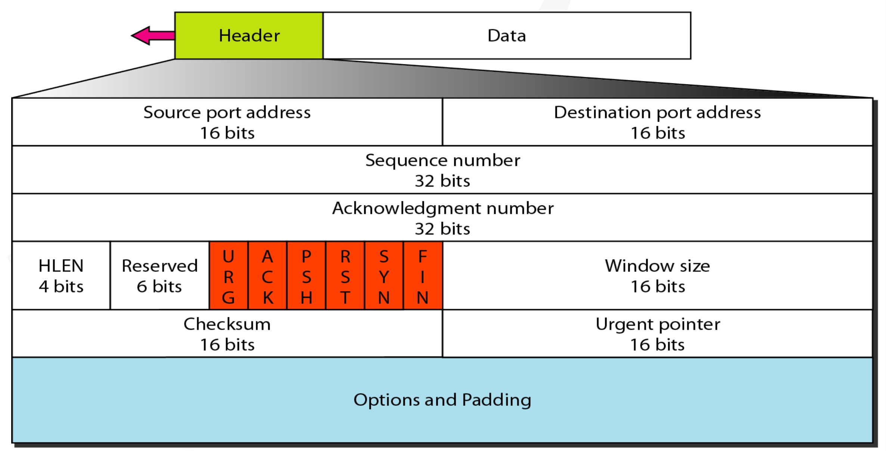

# 传输层

## UDP

### 特点

无连接，及可能最大交付，没有拥塞控制，面向报文（对于应用层下来的报文不合并也不拆分，只添加UDP首部），支持一对一、一对多、多对一和多对多的交互通信

### 首部字段

8个字节：

- 16位源端口号
- 16位目的端口号
- 16位UDP长度
- 16位UDP校验和

## TCP

### 特点

面向连接，提供可靠交付，有流量控制，拥塞控制，提供全双工通信（双方可以在同一时间传输），面向字节流（把应用层传下来的报文看成字节流，把字节流组织成大小不等的数据块），每一条TCP连接只能是点对点。

### 首部字段

- **序号**：对字节流进行编号
- **确认号**：由接收者发送，期望收到的下一个报文段的序号
- **数据偏移(HLEN)**：数据部分距离报文起始处的偏移量。其实就是Header Length
- **保留位**：预留给未来使用
- **控制位**：
    - **URG**：表示包中有需要紧急处理的数据，对于需要紧急处理的数据，与后面的紧急指针有关（通常不用）
    - **ACK**：确认应答的字段有效
    - **PSH**：该位设为 1，表示需要将收到的数据立刻传给上层应用协议，若设为 0，则先将数据进行缓存（通常不用）
    - **RST**：表示连接出现异常，需要断开连接reset
    - **SYN**：用于建立连接
    - **FIN**：表示之后不再有数据发送，希望断开连接
- **窗口大小**：由接受者发送，让发送方设置其发送窗口为接受方能接受的范围，因为接收方的数据缓存空间是有限的

### 可靠机制

- 可靠要求
    - 传输的信道不产生差错
    - 保证传输数据的正确性，无差错、不丢失、不重复、并且按序到达
- 可靠原理
    - **三次握手**建立连接，**四次挥手**关闭连接，保证传输信道是可靠的
    - 采用**连续ARQ协议(Go-Back-N ARQ)**，保证数据传输的正确性，使用**滑动窗口**保证接收方能及时处理接收到的数据，进行**流量控制**
    - 使用**慢开始**、**拥塞避免**、**快重传**、**快恢复**来进行**拥塞控制**，避免网络阻塞

### 连接控制

#### 三次握手

- 过程

    初始状态，客户端处于close状态，服务端处于listen状态

    1. **第一次握手**：客户端向服务端发送一个带有SYN报文的数据包，并指明客户端的初始化序列号ISN(Initial Sequence Number)。此时客户端处于SYN_Send状态
    2. **第二次握手**：服务端收到客户端的SYN报文后，以自己的SYN=1作为应答，并且制定自己的ISN，同时以客户端的ISN+1作为ack的值，表示自己收到的客户端的SYN。此时服务端处于SYN_REVD的状态
    3. **第三次握手**：客户端收到SYN报文后，若检查正确，会以服务端的ISN+1作为ack的值发送ACK报文回去，表示收到了服务端的SYN报文。此时客户端处于established状态。
    4. 服务端收到ACK报文后，若检查正确，则也变成established状态，连接建立成功

- 作用

    1. 确认双方的接受能力、发送能力是否正常。
    2. 指定自己的初始化序列号，为后面的可靠传送做准备。
    3. 如果是 https 协议的话，三次握手这个过程，还会进行数字证书的验证以及加密密钥的生成。

- 补充：**为何需要第三次握手**

    第一次握手：客户端发送网络包，服务端收到了。这样服务端就能得出结论：客户端的发送能力、服务端的接收能力是正常的。
    第二次握手：服务端发包，客户端收到了。这样客户端就能得出结论：服务端的接收、发送能力，客户端的接收、发送能力是正常的。不过此时服务器并不能确认客户端的接收能力是否正常。 第三次握手：客户端发包，服务端收到了。这样服务端就能得出结论：客户端的接收、发送能力正常，服务器自己的发送、接收能力也正常。

#### 四次挥手

- 过程 

    初始状态，客户端和服务端都处于established状态，假定是由客户端先发起关闭请求

    1. **第一次挥手**：客户端发送一个FIN报文，用于关闭客户端到服务端的数据传送，然后等待服务器的确认，报文中指定一个序列号，且FIN=1。此时客户端处于CLOSED_WAIT1状态
    2. **第二次挥手**：服务端收到FIN后，发回一个ACK报文，把客户端的序列号值+1作为ack的值，表明已经收到客户端的报文。此时服务端处于CLOSE_WAIT2状态
    3. **第三次挥手**：和客户端的第一次挥手一样，服务端发送FIN报文给客户端，用于关闭服务端到客户端的连接，也指定一个序列号。此时服务端处于LAST_ACK状态
    4. **第四次挥手**：客户端收到FIN后，一样发送一个ACK报文作为应答，且把服务端作为自己的ACK报文的序列号值，此时客服端处于TIME_WAIT状态，需过一小段时间（两个生命周期2MSL）以确保服务端收到自己的ACK报文后才进入CLOSED状态。
    5. 服务端收到ACK报文后，关闭连接，处于CLOSED状态。

- 补充

    - 首先进行关闭的一方执行主动关闭（例子中为客户端），另一方执行被动关闭。
    - TIME_WAIT状态是因为，客户端要确认服务端已收到自己的ACK报文，若其未收到，服务端会重新发送FIN报文给客户端，客户端再次收到FIN后，可以得知上一个ACK报文丢失，会再次发送。并且为了让本连接持续时间内所产生的所有报文都从网络中消失，使得下一个新的连接不会出现旧的连接请求报文

### 流量控制机制

接收方在收到数据包以后，可以在发送确认报文时，同时告诉对方自己缓冲区还剩多少剩余空间，也就是窗口大小。发送方收到后，会调整自己的发送速率，即调整自己的发送窗口大小，当发送方收到接收窗口大小为0时，发送方会停止发送数据，防止丢包。

当发送方收到接收窗口win=0时，停止发送报文，并同时开启一个定时器，每隔一段时间发送一个测试报文询问接收方是否可以继续发送数据，如果可以，接收方就告知此时接收窗口大小，如果仍为0，则发送方再次刷新启动定时器。

### 拥塞控制

**慢开始、拥塞避免、快重传、快恢复**

发送方需要维护一个叫做拥塞窗口（cwnd）的状态变量，注意拥塞窗口与发送方窗口的区别：拥塞窗口只是一个状态变量，实际决定发送方能发送多少数据的是发送方窗口。

> **慢开始与拥塞避免**
>
> 
>
> 发送的最初执行慢开始，令 cwnd = 1，发送方只能发送 1 个报文段；当收到确认后，将 cwnd 加倍，因此之后发送方能够发送的报文段数量为：2、4、8 ...
>
> 
>
> 注意到慢开始每个轮次都将 cwnd 加倍，这样会让 cwnd 增长速度非常快，从而使得发送方发送的速度增长速度过快，网络拥塞的可能性也就更高。设置一个慢开始门限 ssthresh，当 cwnd >= ssthresh 时，进入拥塞避免，每个轮次只将 cwnd 加 1。
>
> 
>
> 如果出现了超时，则令 ssthresh = cwnd / 2，然后重新执行慢开始。
>
> 
>
> **快重传与快恢复**
>
> 
>
> 在接收方，要求每次接收到报文段都应该对最后一个已收到的有序报文段进行确认。例如已经接收到 M1 和 M2，此时收到 M4，应当发送对 M2 的确认。
>
> 
>
> 在发送方，如果收到三个重复确认，那么可以知道下一个报文段丢失，此时执行快重传，立即重传下一个报文段。例如收到三个 M2，则 M3 丢失，立即重传 M3。
>
> 
>
> 在这种情况下，只是丢失个别报文段，而不是网络拥塞。因此执行快恢复，令 ssthresh = cwnd / 2 ，cwnd = ssthresh，注意到此时直接进入拥塞避免。
>
> 
>
> 慢开始和快恢复的快慢指的是 cwnd 的设定值，而不是 cwnd 的增长速率。慢开始 cwnd 设定为 1，而快恢复 cwnd 设定为 ssthresh。

### 粘包拆包

#### 为什么常说 TCP 有粘包和拆包的问题而不说 UDP 

UDP 是基于报文发送的，UDP首部采用了 16bit 来指示 UDP 数据报文的长度，因此在应用层能很好的将不同的数据报文区分开，从而避免粘包和拆包的问题。

而 TCP 是基于字节流的，虽然应用层和 TCP 传输层之间的数据交互是大小不等的数据块，但是 TCP 并没有把这些数据块区分边界，仅仅是一连串没有结构的字节流；另外从 TCP 的帧结构也可以看出，在 TCP 的首部没有表示数据长度的字段，基于上面两点，在使用 TCP 传输数据时，才有粘包或者拆包现象发生的可能。

#### 什么是粘包、拆包

假设 Client 向 Server 连续发送了两个数据包，用 packet1 和 packet2 来表示，那么服务端收到的数据可以分为三种情况，现列举如下：

- 接收端正常收到两个数据包，即没有发生拆包和粘包的现象。
- 接收端只收到一个数据包，但是这一个数据包中包含了发送端发送的两个数据包的信息，这种现象即为粘包。这种情况由于接收端不知道这两个数据包的界限，所以对于接收端来说很难处理。
- 接收端收到了两个数据包，但是这两个数据包要么是不完整的，要么就是多出来一块，这种情况即发生了拆包和粘包。这两种情况如果不加特殊处理，对于接收端同样是不好处理的。

#### 为什么会发生 TCP 粘包、拆包

- 要发送的数据大于 TCP 发送缓冲区剩余空间大小，将会发生拆包。
- 待发送数据大于 MSS（最大报文长度），TCP 在传输前将进行拆包。
- 要发送的数据小于 TCP 发送缓冲区的大小，TCP 将多次写入缓冲区的数据一次发送出去，将会发生粘包。
- 接收数据端的应用层没有及时读取接收缓冲区中的数据，将发生粘包。

#### 解决办法

只能通过上层的应用协议栈设计来解决，根据业界的主流协议的解决方案，归纳如下：

- **消息定长：**发送端将每个数据包封装为固定长度（不够的可以通过补 0 填充），这样接收端每次接收缓冲区中读取固定长度的数据就自然而然的把每个数据包拆分开来。
- **设置消息边界：**服务端从网络流中按消息边界分离出消息内容。在包尾增加回车换行符进行分割，例如 FTP 协议。
- **将消息分为消息头和消息体：**消息头中包含表示消息总长度（或者消息体长度）的字段。
- 更复杂的应用层协议比如 Netty 中实现的一些协议都对粘包、拆包做了很好的处理。