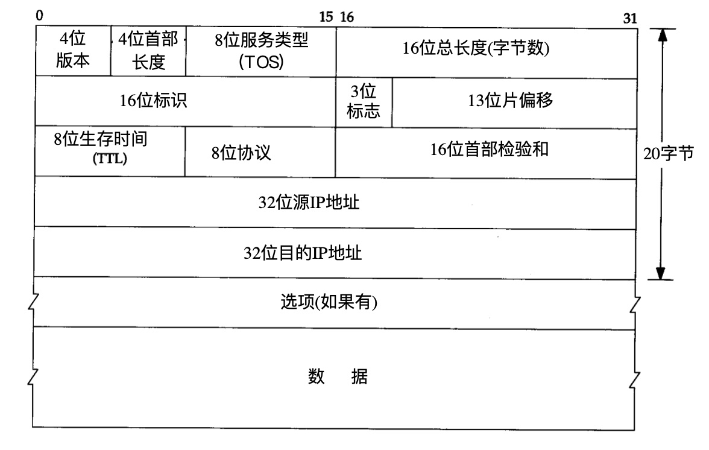
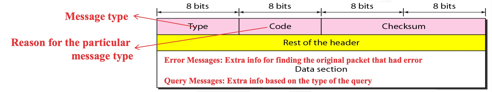

# 网络层

**实现主机与主机之间的通信，也叫点对点（end to end）通信。**

## IP协议

### 首部格式

- **版本**：IPv4
- 首部长度：为4位，因此最长为60bit
- 服务类型：
- 总长度：最大65536
- 标识（identification）
- 生存时间（TTL）

### IP分片

### 路由

## ICMP协议

### 报文格式

### 报文分类

- 查询报文类型

    - 0 - 回送应答（ping应答）
    - 8 - 回送请求（ping请求）

- 差错报文类型

    - 3 - 目标不可达
    - 4 - 原点抑制
    - 5 - 重定向或改变路由
    - 11 - 超时

    